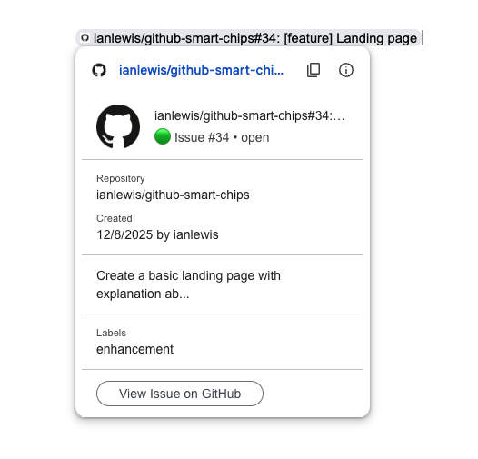

# GitHub Smart Chips

[](https://github.com/ianlewis/github-smart-chips/actions/workflows/pull_request.tests.yml)
[](https://codecov.io/gh/ianlewis/github-smart-chips)
[](https://securityscorecards.dev/viewer/?uri=github.com%2Fianlewis%2Fgithub-smart-chips)

A Google Docs add-on that provides smart chips with preview links for GitHub
issues and pull requests. This add-on displays GitHub issue and PR information
directly in Google Docs with rich preview cards.



## Features

- **Smart Chips for GitHub Links**: Automatically recognizes GitHub issue and PR
  URLs
- **Rich Previews**: Displays repository owner, name, issue/PR number, title,
  and status
- **OAuth Authentication**: Supports private repositories via GitHub OAuth

### Supported URL Patterns

- `https://github.com/{user/org}`
- `https://github.com/{owner}/{repo}`
- `https://github.com/{owner}/{repo}/issues/{number}`
- `https://github.com/{owner}/{repo}/pull/{number}`

## Architecture

The add-on is implemented in TypeScript and compiled to JavaScript for Google
Apps Script. It uses:

- **Google Apps Script**: Runtime environment
- **OAuth2 Library**: For GitHub authentication
- **GitHub REST API**: To fetch issue and PR data
- **Link Preview Triggers**: To detect and handle GitHub URLs

## Development

### Prerequisites

#### Local Environment

- Node.js (see `.node-version`)
- Python (see `.python-version`)
- GNU Make

#### Google Apps Script Project

To test the add-on, you need to create a Google Apps Script project and set up
OAuth credentials:

```bash
# Authenticate with Google.
make login

# Create a new Apps Script project.
make script
```

### Setup

Dependencies are managed within the project by the `Makefile`. Some of the more
common tasks are:

```bash
# Build the project
make build

# Run tests
make unit-test

# Run linters
make lint

# Format code
make format
```

### Project Structure

```text
src/
├── addon.ts      - Main add-on logic and link preview handler
├── github.ts     - GitHub URL parsing and API calls
├── oauth.ts      - OAuth2 authentication with GitHub
├── types.ts      - TypeScript type definitions
├── ui.ts         - UI components (cards and smart chips)
└── index.ts      - Entry point
```

## Self-Hosting

Due to limitations in the Google Workspace Marketplace, this add-on cannot be
published there. However, you can self-host the add-on for your own use or
organization.

See [SELF-HOSTING.md](./SELF-HOSTING.md) for detailed instructions on deploying
and configuring your own instance of the add-on.

## License

Licensed under the Apache License, Version 2.0. See [LICENSE](./LICENSE) for
details.
