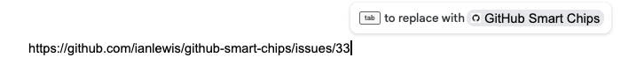
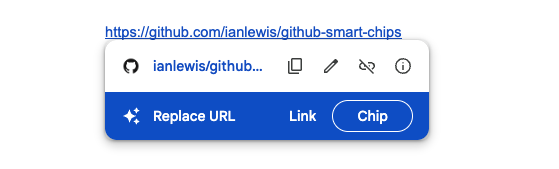
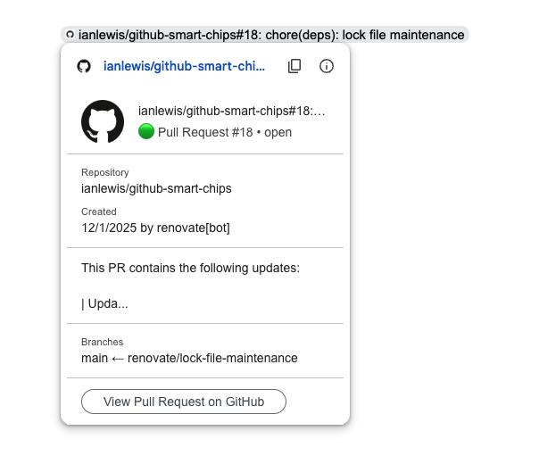

# GitHub Smart Chips Add-on for Google Workspace™︎

A Google Workspace™︎ add-on that provides smart chips with preview links for
GitHub issues and pull requests. This add-on displays GitHub repository, user,
issue, pull request, and project information directly in Google Docs™︎, Google
Sheets™︎, and Google Slides™︎.

## Features

- **Smart Chips for GitHub Links**: Automatically recognizes GitHub issue and PR
  URLs.
- **Rich Previews**: Displays repository owner, name, issue/PR number, title,
  and status.
- **OAuth Authentication**: Supports private repositories via GitHub OAuth.
- **Cross-Platform**: Works in Google Docs™, Sheets™, and Slides™︎.
- **Multiple URL Patterns**: Supports various GitHub URLs:
    - User: `https://github.com/{user/org}`
    - Repository: `https://github.com/{owner}/{repo}`
    - Issue: `https://github.com/{owner}/{repo}/issues/{number}`
    - Pull Request: `https://github.com/{owner}/{repo}/pull/{number}`
    - Organization Project: `https://github.com/orgs/{org}/projects/{number}`
    - User Project: `https://github.com/users/{user}/projects/{number}`

## Usage

After installation, simply paste a GitHub issue or pull request URL into a
Google Doc, Sheet, or Slide. A prompt will appear to convert the URL into a
smart chip.

You can also convert existing links to a chip by putting the cursor over the
link and clicking the "Chip" button that appears in the "Replace URL" prompt.

After the smart chip is created, hovering over it will display a rich preview
with additional information about the link target. For example, here is a what
the preview for a pull request looks like:

## Self-Hosting

Due to limitations in the Google Workspace™︎ Marketplace requiring the developer
of smart chips add-ons to be affiliated with the previewed domain, this add-on
cannot be published publicly. However, you can self-host the add-on for your own
use or Google Workspace™︎ organization.

See the [Self-Hosting Guide](./docs/SELF-HOSTING.md) for detailed instructions
on deploying and configuring your own instance of the add-on.

## License

Licensed under the Apache License, Version 2.0. See [LICENSE](./LICENSE) for
details.
