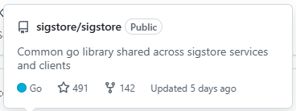
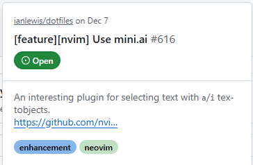
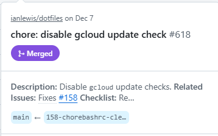

# Design Specification

## Overview

The purpose of this document is to outline the design specifications for the
project. It includes details on architecture, components, interfaces, and data
flow.

## Architecture

### Architecture Overview

The system architecture is based on a modular design, allowing for scalability
and maintainability. The main components include:

1. **Google Workspace Add-on**: The primary interface for users to interact with
   the application.
2. **User Interface (UI)**: The front-end component that interacts with users.
   This will be built using HTML, CSS, and JavaScript, and the App Script
   `CardService`.
3. **GitHub API Client**: A GitHub API client to fetch and manage repository
   data using the Apps Script `UrlFetchApp` API.
4. **Authentication**: Handles OAuth2 authentication with GitHub using the
   Apps Script `OAuth2` library.

### Logic Flow

1. **User Interaction**: The user interacts with the Google Workspace Add-on
   within Google Docs, Sheets, or Slides by attempting to create a link preview
   for a GitHub repository URL.
2. **Link Preview Trigger**: The add-on's `onLinkPreview` function is triggered,
   which processes the provided GitHub URL.
3. **URL Parsing**: The add-on parses the URL to determine the type of link
   (repository, issue, pull request) and extracts relevant parameters (owner,
   repo name, issue number, pull request number).
4. **Fetching Data**: The add-on attempts to fetch the necessary data from the
   GitHub API using the GitHub API client. If authentication is required (e.g.
   a 403 or 404 is returned), the add-on will prompt the user to authenticate.
5. **Displaying Preview**: Once the data is retrieved, the add-on constructs a
   preview card using the Card Service and displays it to the user.

## Components

## Google Workspace Add-on

The [Google Workspace Smart Chips
Add-on](https://developers.google.com/workspace/add-ons/guides/preview-links-smart-chips)
will serve as the main entry point for users. It will integrate with
Google Workspace applications such as Google Docs, providing a seamless
experience for accessing GitHub repository preview links directly from these
applications.

The add-on configuration will be defined in the `appsscript.json` manifest file,
specifying the add-on's capabilities, scopes, and entry points.

The add-on will define an `onLinkPreview` link preview trigger function that
will be called when a user attempts to create a link preview for a GitHub
repository URL.

The `linkPreviewTriggers` configuration will match all `github.com` URLs.

```json
"docs": {
  "linkPreviewTriggers": [
    {
      "runFunction": "onLinkPreview",
      "patterns": [
        {
          "hostPattern": "github.com",
          "pathPrefix": "*/*"
        }
      ]
    }
  ]
}
```

The add-on will support Google Docs, Google Sheets, and Google Slides. It should
include a function for parsing the GitHub URL to determine the type of link
(e.g., repository, issue, pull request) and extract relevant parameters (e.g.,
owner, repo name, issue number, pull request number). These details will be used
to fetch additional data from the GitHub API.

The following GitHub links will be supported:

- Repository links (e.g., `https://github.com/owner/repo`)
- Issue links (e.g., `https://github.com/owner/repo/issues/123`)
- Pull Request links (e.g., `https://github.com/owner/repo/pull/123`)
- User profile links (e.g., `https://github.com/username`)

### User Interface (UI)

The UI will utilize [Google Apps Script Card
Service](https://developers.google.com/apps-script/reference/card-service)
to create interactive cards for displaying preview link information and user
interaction.

The UI will include components such as:

- **Authentication Card**: Prompts users to authenticate with GitHub if they
  are not already authenticated.
- **Preview Card**: Displays detailed information card for the link. Details for
  each link type are below.
- **Error Card**: Displays error messages when issues occur, such as failed
  authentication or API errors.

#### Preview Link Details

The preview link will display a smart chip with relevant information based on
the type of GitHub link provided. The smart chip is cached by Google Docs,
Sheets, or Slides so it should only include the most essential information that
doesn't change frequently.

All chips will include a GitHub Octocat icon.

- **Repository Link Smart Chip**: The smart chip will display the repository
  name (owner/repo).
  e.g. `octocat/Hello-World`
- **Issue Link Smart Chip**: The smart chip will display the repository name
  (owner/repo), issue title, and number.
  e.g. `octocat/Hello-World#123: Bug in code`
- **Pull Request Link Smart Chip**: The smart chip will display the repository
  name (owner/repo), PR title, and number.
  e.g. `octocat/Hello-World#123: feat: Fix bug in code`
- **User Profile Link Smart Chip**: The smart chip will display the user's
  username and name in the format `username (name)`.
  e.g. `ianlewis (Ian Lewis)`

#### Card Details

The cards will be designed to provide a clean and informative layout for users.
They will utilize various Card Service components such as `CardSection`,
`TextParagraph`, `Image`, and `Button` when necessary to create an engaging user
experience.

- **Authentication Card**: The authentication card will prompt users to
  authenticate with GitHub if authentication is required. It will include a
  short instructions and a button that initiates the OAuth2 flow. See the
  [Authentication section](#authentication) for more details. It will include:
    - A title indicating authentication is required.
    - A brief description of why authentication is needed.
    - A button to start the authentication process.

- **Error Card**: The error card will display a message indicating the nature
  of the error and possible steps to resolve it. It will include:
    - A title indicating an error occurred.
    - A detailed message describing the error.
    - A button to retry the operation or re-authenticate if necessary.

Each link type will have specific details displayed in the preview card:

- **Repository Preview Card**: The preview card will display a card with repository
  details that resembles GitHub's own repository overview.

    

    The card will include the following information:
    - The full repository name (owner/repo) with a link to the repository.
    - Repository description.
    - Private/public status
    - Primary programming language
    - star count
    - fork count
    - A string describing when it was last updated (e.g. "updated yesterday").

- **Issue Preview Card**: The preview card will display a card with repository
  issues that resembles GitHub's own issue overview.

    

    The card will include the following information:
    - The repository name (owner/repo) with a link to the repository.
    - The date the issue was created.
    - The issue title with a link to the issue.
    - Issue number.
    - Issue state (open/closed).
    - The user who opened the issue.
    - A snippet of the issue body/description (first 50 characters).
    - Labels associated with the issue.

- **Pull Review Preview Card**: The preview card will display a card with
  repository pull request that resembles GitHub's own pull request overview.

    

    The card will include the following information:
    - The repository name (owner/repo) with a link to the repository.
    - The date the pull request was created.
    - The pull request title with a link to the pull request.
    - Pull request number.
    - Pull request state (open/closed/merged).
    - The user who opened the pull request.
    - A snippet of the pull request body/description (first 50 characters).
    - The branches involved in the pull request (BASE <- HEAD).

- **User Profile Preview Card**: The preview card will display a card with user
  profile information that resembles GitHub's own user profile overview.

    The card will include the following information:
    - The user's full name (or username if name is not available) with a link
      to the user's profile.
    - The user's avatar image.
    - The user's bio/description.
    - Username (with @ prefix).
    - Location (if available).
    - Company (if available).
    - Number of public repositories.
    - Follower and following counts.
    - Website/blog URL (if available).
    - Account creation date (displayed as relative time, e.g. "Joined 5 years
      ago").

### GitHub API Client

The GitHub API client will be responsible for making authenticated requests
to the GitHub API to fetch the necessary data. It will utilize the Apps Script
`UrlFetchApp` service to perform HTTP requests. The client will include
functions to:

- Fetch repository details.
- Fetch issue details.
- Fetch pull request details.
- Fetch user profile details.

The client should be designed as a reusable class (`GitHubAPIClient`) in a
JavaScript module. The class constructor should take an OAuth2 access token as a
parameter to authenticate requests. This token will be included in the
`Authorization` header of each request as a bearer token.

The client should include TypeScript type definitions for the relevant API
objects returned by GitHub.

- [Get a repository](https://docs.github.com/en/rest/repos/repos?apiVersion=2022-11-28#get-a-repository)
- [Get an issue](https://docs.github.com/en/rest/issues/issues?apiVersion=2022-11-28#get-an-issue)
- [Get a pull request](https://docs.github.com/en/rest/pulls/pulls?apiVersion=2022-11-28#get-a-pull-request)
- [Get a user](https://docs.github.com/en/rest/users/users?apiVersion=2022-11-28#get-a-user)

When the API returns errors, they should be returned to the caller so that it
can handle them appropriately (e.g., displaying an authentication or error
card).

### Authentication

The authentication component will use OAuth2 to securely connect to GitHub.
It will manage access tokens and refresh tokens to ensure continuous access to
the GitHub API.

The add-on will use the Apps Script `OAuth2` library to handle the OAuth2 flow.
The client ID and client secret will be stored securely in the Apps Script
Properties Service.

For more information on connecting third-party services using OAuth2 in
Google Workspace Add-ons, refer to the
[official documentation](https://developers.google.com/workspace/add-ons/guides/connect-third-party-service).

The authentication flow will include:

1. **Authorization Request**: When the user attempts to create a link preview
   and authentication is required, the add-on will generate an authorization URL
   and prompt the user via the [Authentication Card](#card-details) to
   authorize the application.
2. **Token Exchange**: After the user authorizes the application, the add-on
   will exchange the authorization code for an access token and refresh token.
3. **Token Storage**: The access token and refresh token will be securely stored
   using the Apps Script Properties Service.
4. **Token Refresh**: The add-on will handle token refresh automatically when
   the access token expires.
5. **Authenticated Requests**: The access token will be included in the
   `Authorization` header of each request made to the GitHub API.
