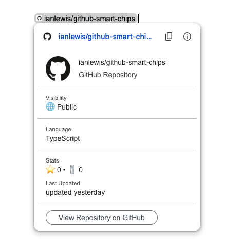

GitHub Smart Chips is a Google Docs™ add-on that provides smart chips with
preview links for GitHub issues and pull requests. This add-on displays GitHub
issue and pull request information directly in Google Docs™ with rich preview
cards.

# Getting Started

<!-- TODO: add instructions and image for installation -->

## Usage

After installing the add-on, when you paste a GitHub link into your Document can
convert the link into a smart chip with a rich preview card. After pasting a
link, you will see a prompt to convert the link into a smart chip. At this point
you can convert the link to a smart chip by hitting the tab key.

You can also convert an existing link in the link popup.

# Features

The following link types are supported in Google Docs™, Google Sheets™, and
Google Slides™:

## Repositories

Repository links display the repository name in the chip. The repository name,
description, primary language, star count, and fork count are displayed in the
preview card.

## Issues

Issue links display the issue number and title in the chip. The issue title,
status (open/closed), author, labels, and comment count are displayed in the
preview card.

## Pull Requests

Pull request links display the pull request number and title in the chip. The
pull request title, status (open/closed/merged), author, labels, and comment
count are displayed in the preview card.

# Terms & Privacy

This project is not affiliated with GitHub or Google™. Please refer to the [Terms
of Service](./terms.md) and [Privacy Policy](./privacy.md) for more information.
